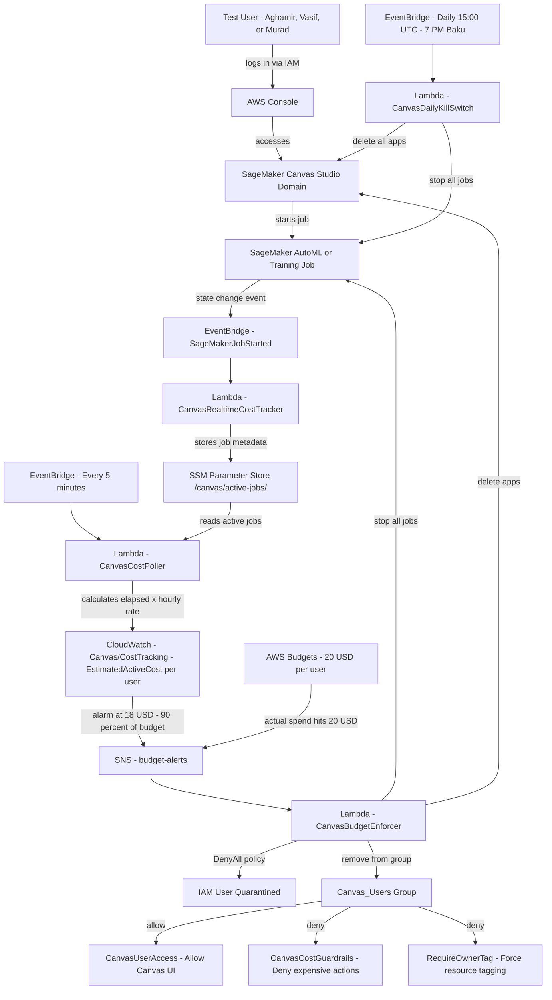

# AWS Canvas Cost Control System

Automated cost enforcement and real-time monitoring for SageMaker Canvas test users.

## Architecture

## Components

| Component | Purpose |
|---|---|
| `lambda_function.py` | Budget breach enforcer — quarantines user, stops all jobs |
| `cost_poller.py` | Runs every 5 min, calculates real-time job cost per user |
| `realtime_cost_tracker.py` | Fires on job start, stores instance type and hourly rate in SSM |
| `daily_killer.py` | Kills all running jobs and Canvas apps at 7 PM Baku time |
| `bedrock-kill-switch.py` | Emergency Bedrock kill switch |
| `bedrock-spike-email-formatter.py` | Bedrock spike email notification formatter |
| `bedrock-spike-telegram-notify.py` | Bedrock spike Telegram notification |

## IAM Policies

| Policy | Type | Purpose |
|---|---|---|
| `CanvasUserAccess` | Allow | Canvas UI, AutoML, S3 dataset access |
| `CanvasCostGuardrails` | Deny | Blocks expensive instances, model storage, deployment |
| `RequireOwnerTag` | Deny | Forces Owner tag on all SageMaker resources |
| `DenyBedrock-Emergency` | Deny | Emergency Bedrock kill switch policy |

## Budget Rules

| User | Monthly Limit | Alert at | Action |
|---|---|---|---|
| Aghamir_test_user | $100 | $90 (CloudWatch) or $100 (actual) | Quarantine + stop all jobs |
| Vasif_test_user | $100 | $90 (CloudWatch) or $100 (actual) | Quarantine + stop all jobs |
| Murad_test_user | $100 | $90 (CloudWatch) or $100 (actual) | Quarantine + stop all jobs |

## Restore Access (after quarantine)

1. **IAM → Users → username → Permissions** — delete `Quarantine` inline policy
2. **IAM → Roles → CanvasRestrictedExecutionRole → Permissions** — delete `Quarantine` and `RevokeActiveSessions` inline policies
3. **IAM → Users → username → Groups** — add back to `Canvas_Users`
4. **Billing → Budgets → budget name** — update limit if needed
